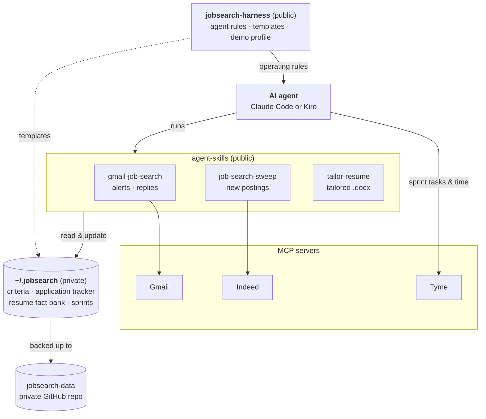

*Notes on running a job search like an engineering project.*

A job search has the shape of a messy distributed system. Job alerts arrive in your inbox from four different boards. Postings live on sites that each describe "remote" differently. Applications go out through a dozen applicant tracking systems, and replies come back days later with subject lines that don't always say what they mean. Your resume needs a slightly different emphasis for every role, and keeping track of which version went where is its own job.

I decided to treat it the way I'd treat any system I was responsible for: give it structure, automate the tedious parts, keep a record, and learn from the results. Over a few days, working with AI coding agents (first Kiro, then Claude Code), I built what I've been calling a **job search harness**. This post covers what it is, how it's organized, and what I learned building it.

## The idea: process in public, data in private

The first design decision turned out to be the most important one: **separate the process from the personal data.**

The harness is two public repositories:

- **[jobsearch-harness](https://github.com/robinsjm2/jobsearch-harness)** holds the operating model: agent instructions, templates, setup guides, and a demo profile.
- **[agent-skills](https://github.com/robinsjm2/agent-skills)** holds reusable AI agent skills that don't know anything about me.

My actual data — job criteria, the application tracker, sprint plans, my resume fact bank — lives in a local directory, `~/.jobsearch/`, backed up to a **private** repository. The skills read from it by convention; nothing personal ever touches the public repos.

My first version mixed these together. Sprint plans and criteria sat in the same repo as the templates, and gitignoring the personal files felt like a patch rather than a design. Moving the data out entirely meant there was nothing to accidentally commit. The agent instructions now even explain *why* the data repo must stay private when helping someone set it up: a public repo would expose contact details, pay expectations, every application and rejection, and the fact that you're looking at all.

## The moving parts

The harness connects an AI agent to the tools a job search already uses, through the Model Context Protocol (MCP):

- **Tyme** for sprint tasks and time tracking. I run the search in two-week sprints, and the agent helps plan them and set up the tasks.
- **Gmail** for job alerts, application confirmations, and replies.
- **Indeed** for searching new postings directly.

On top of those sit three skills.

**`gmail-job-search`** reviews the inbox. It filters alert emails against my criteria, recognizes replies to applications I've already submitted, and updates the tracker. Early on it missed a rejection because the subject line was "Thanks for your interest in…" rather than anything containing "application." The fix was to stop guessing from subjects and search by *sender*: the dozen applicant tracking systems that send these emails. It now also catches applications I'd forgotten to track.

**`job-search-sweep`** searches for new openings and verifies them against the full posting. That verification matters more than I expected: a search filtered to "remote" happily returns on-site roles, and the location in a summary is often just headquarters. The skill only calls a role remote if the posting says so.

**`tailor-resume`** turns one posting into a tailored resume and renders it to Word. It's the part I'm proudest of, and the part that taught me the most.

## A resume skill that can't make things up

The obvious risk with an AI writing resumes is that it embellishes. So the skill is built around a **fact bank**: a private file of verified claims about my experience. Every bullet in a tailored resume has to trace back to an entry in it. The skill can choose, reorder, and rephrase, but it can't add a skill, a number, or an outcome that isn't there.

When a posting asks for something the fact bank doesn't cover, the skill asks me. If I have the experience, it records the specifics and uses them. If I don't, it reports the gap instead of papering over it. Those conversations turned out to be valuable on their own: they pulled out details I'd never written down, from specific technical decisions to migrations I'd forgotten were worth mentioning.

Two things made it work in practice:

- **A lessons file.** Feedback becomes rules. When I pointed out that a summary written in fragments ("Treats AI as…") was grammatically wrong, that became a rule. So did how I describe my location, how many years of experience to state, and that cover letters are never reused between companies. The skill reads these before every draft.
- **Outcome tracking.** Each application records which resume version and angle it used. As replies come in, the stage it reached is logged, so over time I can see which framings get past the resume screen and which don't.

It also caught its own mistakes, with my help. One claim had been carried over from an older resume, and when I looked at it closely, it overstated what I'd built. I corrected the fact bank, and the skill now has a rule with the accurate wording. A system like this is only as honest as its source of truth, and the source of truth needs reviewing too.

## Lessons from building it

**Ask one question at a time.** Early on, I'd get a numbered list of eight gap questions and have to write an essay in response. Switching to a conversational back-and-forth — one question, a short acknowledgment, the next question — made the process faster and the answers better. The agent also now checks whether a role is worth pursuing *before* asking anything.

**Respect the rate limits of the services you depend on.** After a day of heavy searching and demo recording, the Indeed connector started rate-limiting every call. Retrying made the wait longer. The sweep skill now runs calls one at a time, keeps sweeps small, retries once, and stops. I've paused it for now and rely on email alerts.

**Make it demonstrable without exposing yourself.** I wanted to show the harness working, but a real session would expose my inbox and tracker. The repo now includes a fictional "Demo Candidate" profile, mock Gmail and Tyme servers that serve fixture data (the same idea as stubbing external services in tests), and scripted terminal recordings. The GIFs above come from that setup.

**Keep the human in charge of priorities.** The harness rates roles, drafts resumes, and keeps records, but I decide what to apply for. Several times I passed on a role the agent rated well, and those decisions became criteria too: which skills gaps are deal-breakers, which kinds of roles to skip, what pay ranges qualify.

## How the pieces fit together

The public repos hold only behavior: the rules agents follow and the skills they run. Everything personal lives in the private data directory, which the skills read and update by convention. The demo profile swaps in fictional data and mock Gmail and Tyme servers, so the same skills run without touching anyone's real accounts.

## Use it, fork it

If any of this is useful for your own search, you're welcome to use it or fork it:

- **[jobsearch-harness](https://github.com/robinsjm2/jobsearch-harness)**: the operating model, templates, and demo profile
- **[agent-skills](https://github.com/robinsjm2/agent-skills)**: the three skills, usable on their own with any MCP-capable agent

Start with the demo profile in [`examples/demo-persona/`](https://github.com/robinsjm2/jobsearch-harness/tree/main/examples/demo-persona). It runs the skills end to end without any of your data. When you're ready, copy the templates into your own private data directory, write your own criteria and fact bank, and adapt the rules to how you search.

